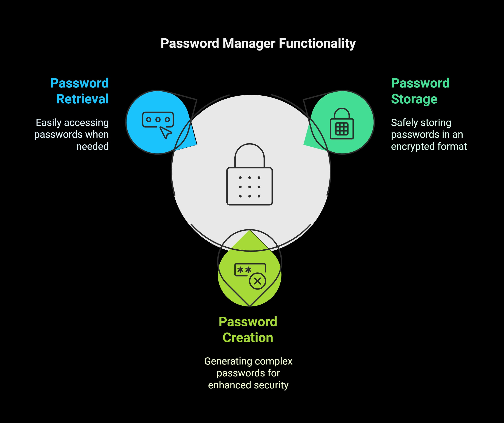

# Password Manager Application



## Overview
This is a feature-rich Password Manager and Generator application built with Python. It allows users to securely store, manage, and generate passwords using modern encryption methods, ensuring the highest level of security for sensitive data.

## Features
1. **Password Vault:**
   - Securely store account credentials (Account name, Username, and Password).
   - Access passwords through a master password system.
   - Encrypted password storage using Fernet symmetric encryption.

2. **Password Generator:**
   - Adjustable criteria (number of letters, digits, and symbols).
   - Generate strong and customizable passwords.

3. **Master Password Protection:**
   - Set up a master password for unlocking the Passwords table.
   - Passwords are hashed using SHA-256 for secure storage.

4. **Recovery Key:**
   - Generate a unique recovery key to reset the master password.
   - Provides a failsafe mechanism in case the master password is forgotten.

5. **User-Friendly Interface:**
   - Modern UI built with CustomTkinter.
   - Intuitive sliders, buttons, and menu options for seamless interaction.

6. **Data Management:**
   - Add, update, or delete entries in the table.
   - Passwords are masked with (*) in the table for added security.

## Technologies Used
- **Python**: Core language.
- **CustomTkinter**: For the modern GUI.
- **SQLite3**: Lightweight database for storing user data.
- **Cryptography**: For encryption and decryption of sensitive data.
- **Pillow (PIL)**: Image processing for UI components.

## Installation
### Prerequisites
- Python 3.7 or later installed on your system.
- Required Python libraries:
  ```bash
  pip install cryptography customtkinter pyperclip pillow
  ```

### Steps to Run
1. Clone this repository:
   ```bash
   git clone https://g...content-available-to-author-only...b.com/BolaWagdy/python-password-manager.git
   cd python-password-manager
   pip install -r requirements.txt
   ```
2. Run the application:
   ```bash
   python password-vault.py
   ```

3. Follow the prompts to set up your master password and recovery key.

## Usage
1. **Password Generator**:
   - Adjust the sliders to set the number of letters, digits, and symbols.
   - Click "Generate Password" to create a strong password.
   - Use the "Copy Password" button to copy it to the clipboard.

2. **Vault Management**:
   - Click "Open Vault" and enter your master password to unlock.
   - Use the "Add Entry" button to store a new account credential.
   - Right-click an entry in the table for options like copy username, copy password, update, or delete.

3. **Recovery**:
   - If you forget your master password, use your recovery key to reset it.

## Security
- All passwords are encrypted using the **Fernet** algorithm, with keys derived from a secure **PBKDF2HMAC** process.
- The master password and recovery key are securely hashed using **SHA-256**.
- The application does not store plaintext passwords.

## File Structure
```
└── 📁images
    └── lock.png
└──.gitignore
└── PROJECT-REPORT.docx
└── password-manager.py
└── README.md
└── requirements.txt
```

## Security

- Passwords are encrypted using **AES encryption** from the `cryptography` library.
- The master password and recovery key are hashed using **SHA-256** for secure storage.

<!-- ## Screenshots

| **Password Generator** | **Vault** |
|-------------------------|-----------|
|  |  |
 -->
